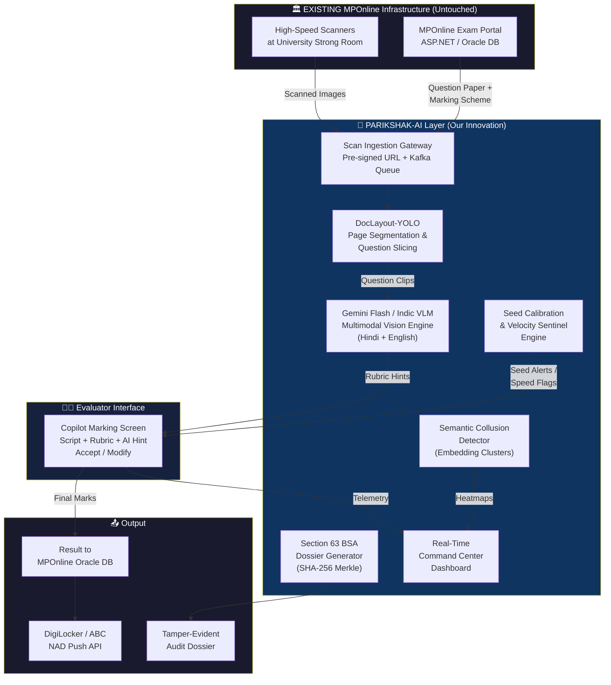
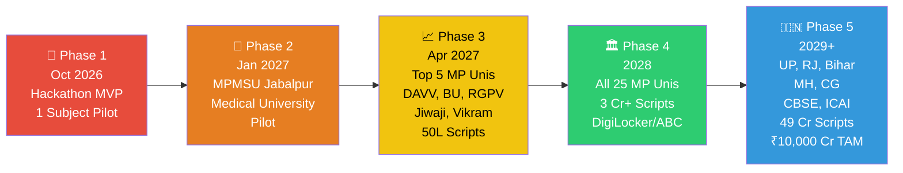
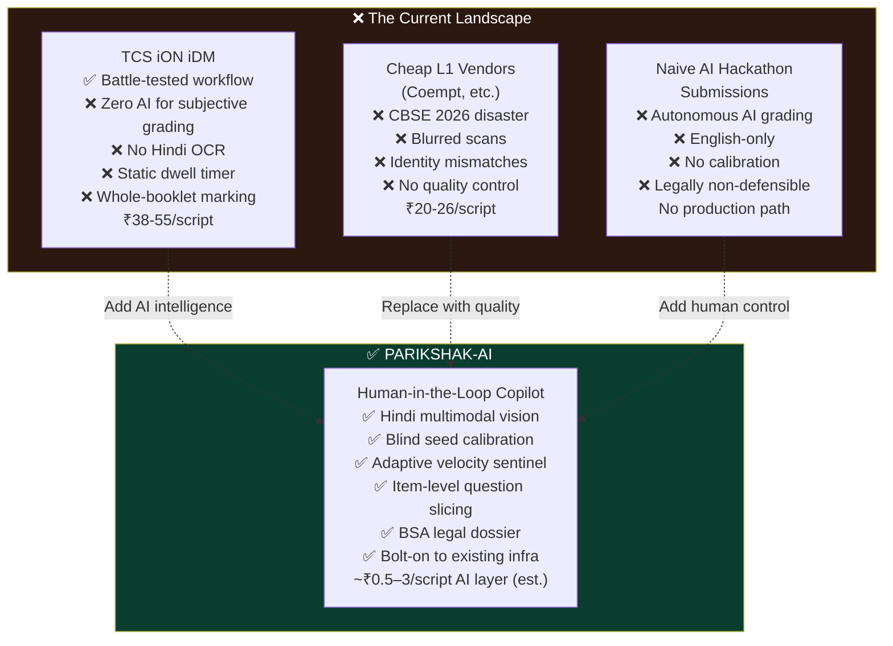
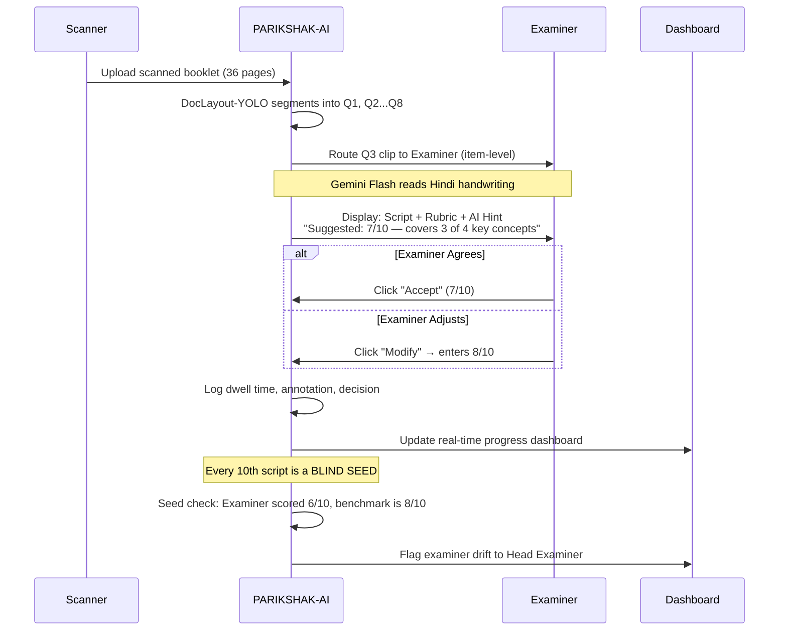
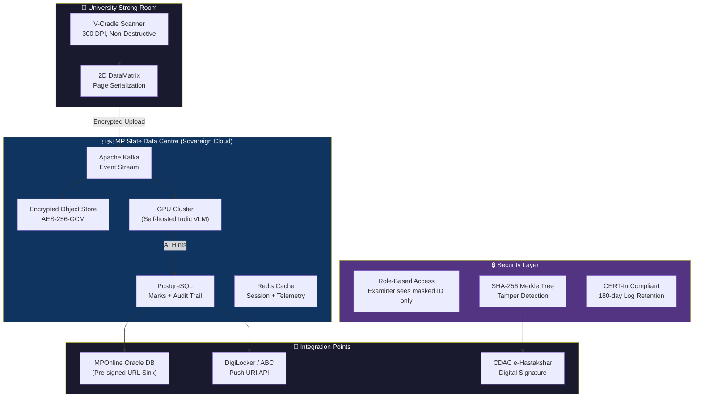

# PARIKSHAK-AI — Presentation Content (Slide-by-Slide)

> **Team eMitra** | Challenge 03 | Technical Track
> Copy this content into Google Slides / Canva / PowerPoint

---

## SLIDE 1 — Title Slide

**PARIKSHAK-AI (परीक्षक-AI)**
*AI-Driven Examination & On-Screen Marking Transformation*

- **Team:** eMitra
- **Challenge:** 03 — AI-Driven Examination & On-Screen Marking Transformation
- **Track:** Technical (First Selection Round)
- **Hackathon:** MPOnline Idea & Innovation Hackathon 2026

> *"Cambridge-grade evaluation rigor. Built for Indian state universities."*

---

## SLIDE 2 — The Crisis (Problem Statement)

**Title:** The Examination Evaluation Crisis in Madhya Pradesh

**3 Hard-Hitting Stats (Use Large Numbers):**

> **~30%** — BU Bhopal results suspected wrong after outsourced processing (~10,000 complaints)

> **43%** — B.Ed pass rate at DAVV Indore before an expert re-evaluation of answer sheets was ordered

> **3–14 Months** — Average result delay across MP state universities. Ordinances expect 30–45 days.

**The Root Cause:**
- 27.7 Lakh students × 11 exams = **3.04 Crore answer scripts/year** in MP alone
- Evaluators paid ₹16–₹25/script. Forced to glance-check 36-page booklets in under 4 minutes
- 5 seconds per page. They don't read — they guess.

---

## SLIDE 3 — 4 Stakeholder Personas

**Title:** Who Suffers? Four Stakeholders, One Broken System

| 👨‍🏫 **The Examiner** | 🏛️ **Controller of Examinations** |
|---|---|
| Underpaid (₹20/copy), exhausted, zero rubric help. Cognitive fatigue by 3 PM → marks become random. | Zero real-time visibility. Relies on 5% post-facto sampling. Defenseless against High Court contempt notices. |

| 👨‍🎓 **The Student** | 🖥️ **MPOnline / Govt** |
|---|---|
| Career destroyed by 14-month delays. Pays ₹500–₹1500 "revaluation tax" to fix arbitrary failures. | Institutional trust erosion. Fragmented vendor tenders. Needs citizen-centric digital public infrastructure. |

---

## SLIDE 4 — Our Solution (The Big Idea)

**Title:** PARIKSHAK-AI — Human-in-the-Loop Cognitive Evaluation Copilot

> ⚠️ **We do NOT replace the teacher. We protect the teacher.**

**One-Line Pitch:**
> A bolt-on AI intelligence layer for MPOnline's existing exam portal that brings Cambridge Assessment-grade quality control to Indian state university evaluation — for an estimated ₹0.5–3 of AI cost per booklet.

**3 Design Principles:**
1. **Human-in-the-Loop:** AI suggests, examiner decides (1-click Accept/Modify)
2. **Bolt-On, Not Replace:** Plugs into MPOnline's existing ASP.NET/Oracle via REST APIs
3. **Sovereign by design:** in production, data and inference stay in the MP State Data Centre or an India-region cloud (MeghRaj).

---

## SLIDE 5 — Technical Architecture (HIGH LEVEL)

**Title:** System Architecture — Bolt-On Intelligence Layer

---

## SLIDE 6 — Detailed Processing Pipeline

**Title:** Answer Booklet Processing Pipeline (End-to-End)

```mermaid
flowchart LR
    A["📄 Physical<br/>Answer Booklet<br/>(36 pages)"] -->|"Non-Destructive<br/>V-Cradle Scan<br/>300 DPI"| B["🖼️ Digital<br/>Page Images<br/>(JPEG/TIFF)"]
    
    B -->|"Barcode Mask<br/>+ Anonymize"| C["🔒 Masked<br/>Script<br/>(Fictitious Code)"]
    
    C -->|"DocLayout-YOLO<br/>Inference<br/><15ms/page"| D["✂️ Question<br/>Clips<br/>(Item-Level)"]
    
    D -->|"Route to<br/>Subject Expert"| E["👨‍🏫 Evaluator<br/>Sees Q1 Only<br/>(Anti-Halo)"]
    
    E -->|"Gemini Flash<br/>Vision Copilot"| F["🧠 AI Hint:<br/>Rubric Match<br/>+ Score Range"]
    
    F -->|"Human Decision:<br/>Accept / Modify"| G["✅ Final<br/>Mark<br/>Recorded"]
    
    G -->|"Auto-Total<br/>+ Validate"| H["📊 Result<br/>Published<br/>in 15-20 Days"]
```

---

## SLIDE 7 — Innovation 1 & 2

**Title:** Core Innovations (1/3)

### 🔤 Innovation 1: Hindi Handwriting Recognition Assistance
**PS Feature:** *"Handwriting recognition assistance"*

| Legacy Approach | Our Approach |
|---|---|
| Image → OCR (Tesseract) → Corrupted Text → LLM hallucinates | Image → **Direct Multimodal Vision** → Gemini reads pen strokes in context |
| CER 35–55% on Hindi cursive | Handles Hindi, English and Hinglish |
| Fails on matras, samyuktakshar | Reads meaning, not just characters |

**Working today:** our proof of concept pre-reads Hindi/Hinglish answers and quotes the evidence for every mark.

### 🎯 Innovation 2: Smart Moderation — Blind Seed Calibration
**PS Feature:** *"Smart moderation workflows"*

- Adapted from **Cambridge RM Assessor** & **IB Diploma Programme** (standard practice in online marking)
- **1 seed injected every 10 scripts** (blind — examiner can't tell)
- ±15% tolerance → auto-flags **Evaluator Drift**
- Drift → CoE alert; the examiner's next scripts go silently to the Head Examiner

---

## SLIDE 8 — Innovation 3 & 4

**Title:** Core Innovations (2/3)

### ⏱️ Innovation 3: Automated Marking Anomaly Detection — Velocity Sentinel
**PS Feature:** *"Automated detection of unchecked answers or marking anomalies"*

**The Problem:** Static timers on legacy OSM are easy to wait out.

**Our Fix:** Dynamic, content-aware reading floor:

$$T_{min} = \left(\frac{N_{words}}{200} + \beta_{math} \times N_{eq} + \gamma_{diag} \times N_{diag}\right) \times 60 + 10s$$

- A 36-page Hindi essay gets a different $T_{min}$ than a 20-page math paper
- 3-Tier Progressive Friction: Soft Nudge → Touchpoint Gate → Silent Shadow Review
- **No lockouts** (avoids faculty union disputes)

### 🔍 Innovation 4: Malpractice Detection — Center-Level Collusion Engine
**PS Feature:** *"Malpractice or unusual scoring pattern detection"*

$$\text{Residual Plagiarism Index} = \frac{S_{center} - \mu_{statewide}}{\sigma_{statewide}}$$

- Detects organized mass-copying syndicates in rural exam centers (Bhind, Morena, Rewa)
- Semantic embedding similarity across all answers from same exam hall
- Flags collusion heatmap to CoE **before** results are published

---

## SLIDE 9 — Innovation 5 & 6

**Title:** Core Innovations (3/3)

### ⚖️ Innovation 5: Faster Results — Section 63 BSA Legal Defense Dossier
**PS Feature:** *"Faster result processing" + "AI-generated evaluation summaries"*

One-click tamper-evident audit PDF containing:
- Anonymized script with digital annotations
- Criterion-level mark justifications with student text quotes
- Dwell-time telemetry (time spent on every page)
- **SHA-256 Merkle root**, signed (CDAC eSign in production) on a hash-chained ledger
- Supplies the particulars for a **Section 63 BSA 2023** certificate

### ✂️ Innovation 6: Item-Level Question Slicing (NEW — Cambridge/Pearson Standard)
**PS Feature:** *"Examiner performance analytics"*

| Current Indian OSM | PARIKSHAK-AI |
|---|---|
| 1 examiner grades entire 36-page booklet | DocLayout-YOLO segments into question clips |
| Halo Effect: bad Q1 → biases Q2–Q10 | Examiner A grades Q1 across 500 students; Examiner B grades Q2 |
| No specialization | Faculty grade only their strongest topics |

**Used by:** Cambridge (RM Assessor), IB, Pearson (ePEN).

---

## SLIDE 10 — Impact Metrics

**Title:** Measurable Impact on Higher Education & Governance

| Metric | Today | With PARIKSHAK-AI | Improvement |
|---|---|---|---|
| **Result Declaration** | 90–420 days | **15–20 days** | 75–85% faster |
| **Unassessed Pages** | 12–18% of booklets | **< 0.1%** | 99% elimination |
| **Inter-Examiner Variance** | Not measured during marking | **Measured live via seed scripts** | Drift caught before results |
| **Revaluation Requests** | 6–9 Lakh/year | **1.8–2.5 Lakh/year** | 65–70% drop |
| **RTI Response Time** | 30–45 days | **One click** | Minutes, not weeks |
| **AI Cost per Booklet** | N/A | **~₹0.5–3 (est.)** | Measured per call |

*Projected figures are targets to be validated in a pilot.*

> **Citizen-centric governance:** Transparent, fast, legally defensible results for 27.7 Lakh MP students.

---

## SLIDE 11 — Policy Alignment & Scalability

**Title:** Strategic Alignment & National Scalability

### Policy Alignment
- **NEP 2020:** Sections 4.35, 12.2, 23.2, 23.8 — AI in assessment, competency-based evaluation
- **NAAC Criterion 2.5:** Metrics 2.5.1 (turnaround), 2.5.2 (grievances), 2.5.3 (EMS automation)
- **UGC Salunkhe Committee:** OBE mapping to COs/POs/Bloom's Taxonomy
- **PM-USHA:** ₹12,926 Cr scheme; infrastructure grants can fund exam-branch automation
- **MP State AI Mission (March 2026):** Phase 1 operationalization

### Scalability Roadmap

---

## SLIDE 12 — Revenue & Sustainability

**Title:** Commercial Sustainability

### MP Revenue Model (Per-Script SaaS)
| Component | Rate | Annual (3.04 Cr scripts) |
|---|---|---|
| AI Copilot Inference | ₹3.00/booklet | ₹9.12 Cr |
| Seed Calibration + Velocity SaaS | ₹1.50/booklet | ₹4.56 Cr |
| BSA Dossier Generation | ₹0.50/booklet | ₹1.52 Cr |
| Command Center License | ₹15L/university × 25 | ₹3.75 Cr |
| **Total MP Revenue** | | **₹18.95 Cr/year** |

### The MPOnline Opportunity
> MPOnline earns ₹25 Cr/yr from exam form fees. The evaluation market (₹60–75 Cr/yr) is **completely untapped.** PARIKSHAK-AI lets MPOnline capture it.

### Funded by Government Grants (Zero University Budget Impact)
> PM-USHA and RUSA infrastructure grants can fund deployment, limiting the impact on university budgets.

---

## SLIDE 13 — Competitor Comparison

**Title:** Why Not Existing Solutions?

---

## SLIDE 14 — Closing Slide

**Title:** Why Team eMitra Should Be Selected

> **We don't replace the examiner. We protect 27.7 Lakh students.**

**3 Reasons:**

1. 🎯 **Problem-First, Not Tech-First:** Every innovation maps directly to the Problem Statement's 10 feature areas
2. 🔒 **Bolt-On, Not Tear-Down:** Works WITH MPOnline/TCS iON infrastructure. Zero migration risk.
3. 🏛️ **Citizen-Centric Governance:** Faster results. Fewer grievances. Audit dossier in one click. Aligned with NEP 2020, NAAC and PM-USHA.
4. 🛠️ **Already working:** a proof of concept of the examiner copilot, seed calibration, reading-time check and signed dossier runs today.

**Team eMitra | PARIKSHAK-AI (परीक्षक-AI)**
GitHub: `https://github.com/nishchaydev/Mphack`

---

## BONUS: Evaluator Copilot UI Flow (For Demo Slide)

---

## BONUS: Data Flow & Security Architecture

