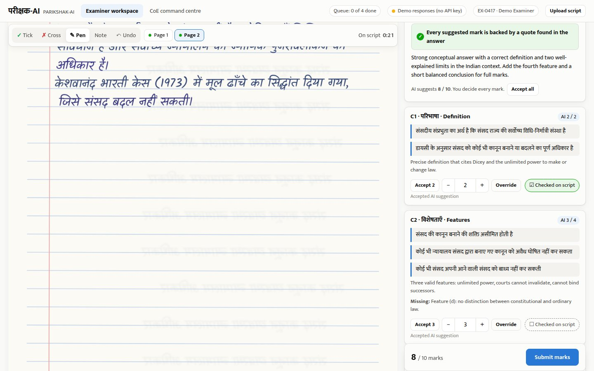
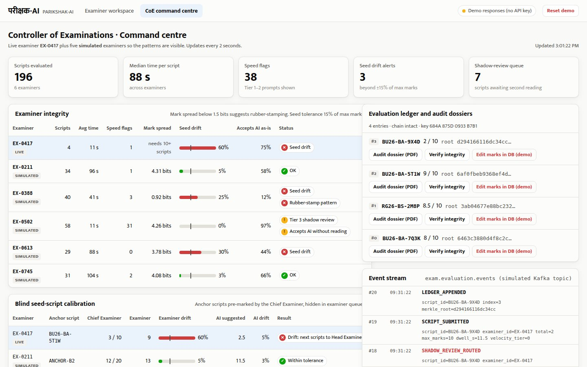

# 🏛️ PARIKSHAK-AI (परीक्षक-AI)

> **AI Examiner Copilot & Quality Assurance Architecture for On-Screen Marking (Hindi + English)**  
> *Technical Proposal & System Architecture for MPOnline Idea & Innovation Hackathon 2026 — Challenge 03*  
> **Track:** Technical Track | **Team:** eMitra | **Submission Date:** October 1, 2026

[](https://innovate.mponline.gov.in)
[]()
[](LICENSE)
[](POC_GUIDE.md)
[]()

---

## 📌 Executive Summary

**PARIKSHAK-AI** is a comprehensive technical architecture and system design for transforming university examination evaluation across Madhya Pradesh. Engineered as an asynchronous, stateless cognitive microservice, it is designed to bolt directly onto **MPOnline's existing ASP.NET Core presentation layer and Oracle 19c Enterprise database cluster** hosted at the **MP State Data Centre (SDC) in Bhopal**.

Rather than attempting an unviable "autonomous AI auto-grader" that violates UGC academic statutes, PARIKSHAK-AI operates as a **Human-in-the-Loop (HITL) Examiner Copilot**. It pairs university professors with multimodal intelligence that eliminates human fatigue, catches data entry errors in real time, and produces legally unassailable audit trails.

> ℹ️ **Current Phase:** This repository contains our **Round 1 submission documents, the system specification, and a working proof of concept** of the core workflow: AI pre-read of handwritten Hindi/English answers against a rubric, the reading-time check, blind seed scripts, and the signed audit dossier with tamper detection. We will extend it during the on-site hackathon (Oct 9–10, 2026, SSR Global Skills Park, Bhopal).

> ▶️ **Run the proof of concept:** `./run.sh` (Windows: `run.bat`), then open http://localhost:8000 (examiner workspace) and http://localhost:8000/coe (CoE command centre). The demo script, what is real versus simulated, and how to measure accuracy are in [POC_GUIDE.md](POC_GUIDE.md).

---

## 🔍 The Ground Reality of Madhya Pradesh Higher Education

State higher education evaluation in Madhya Pradesh operates at staggering scale under severe physical and economic constraints:

```
┌────────────────────────────────────────────────────────────────────────────────────────┐
│                        MADHYA PRADESH HIGHER EDUCATION SCALE                           │
├──────────────────────────┬──────────────────────────┬──────────────────────────────────┤
│    94 Universities       │   2,610+ Colleges        │      28.0 Lakh Students          │
│ (25 State, 55 Private,   │ (Govt, Aided & Private   │ (6th largest state higher-ed     │
│  2 Central, 12 National) │  across 55 districts)    │  enrollment in India - AISHE)    │
├──────────────────────────┴──────────────────────────┴──────────────────────────────────┤
│             ANNUAL VOLUME: OVER 3.0 CRORE HANDWRITTEN ANSWER BOOKLETS                  │
│       (2 Semesters × 5–6 Papers/Semester × 28 Lakh Students = ~30–33M Scripts)         │
└────────────────────────────────────────────────────────────────────────────────────────┘
```

### Recent Systemic Failures in MP University Evaluation

1. **Barkatullah University (BU), Bhopal:** Discrepancies were suspected in around **30% of results** processed by an outsourced agency: candidates who appeared were marked absent, given zero marks or shown wrong subjects, and nearly 10,000 complaints followed.
2. **Devi Ahilya Vishwavidyalaya (DAVV Indore):** Only about **43% of ~7,200 B.Ed candidates passed** a first-semester exam; allegations of faulty evaluation led to an expert re-evaluation of answer sheets. Digital On-Screen Marking plans were also paused over concerns about **spine-cutting and sheet-fed scanning** that risk page swapping.
4. **Rajiv Gandhi Proudyogiki Vishwavidyalaya (RGPV Bhopal):** Physical paper handling vulnerabilities were exposed when 9 sealed question paper bundles were stolen from the confidential examination branch.
5. **The Economic Toll on Students:** Universities collect **₹30 to ₹45 Crore annually** across MP in non-refundable revaluation fees (₹500 to ₹1,500/paper). Over 80% of these revaluations stem directly from totalization slips, unchecked pages, and evaluator fatigue.
6. **The Linguistic Gap:** In general degree streams (BA, B.Com, B.Sc, B.Ed, LLB), an estimated **60%+ of students write examinations in Hindi (Devanagari)**. Off-the-shelf OCR engines (Tesseract, PaddleOCR) exhibit Character Error Rates (CER) of **35%–55%** on unconstrained cursive Devanagari, rendering traditional text-first AI pipelines useless.

---

## 🏛️ Legal & Judicial Backing

PARIKSHAK-AI is specifically architected to comply with recent landmark legal standards in Madhya Pradesh and India:

- **June 2026 MP High Court Ruling (Jabalpur Division Bench):** While upholding digital evaluation for MPMSU, the High Court bench recommended that **examiners evaluate scanned scripts using a digital stylus on touch-screen devices** to mimic conventional marking and eliminate ambiguous deductions.
- **Section 63, Bharatiya Sakshya Adhiniyam (BSA), 2023:** Having replaced Section 65B of the Indian Evidence Act on July 1, 2024, Section 63 governs the admissibility of electronic records. It requires a certificate in the form set out in its Schedule (Part A by the person in charge of the device, Part B by an expert), which records the hash values of the electronic record, with SHA-256 among the accepted algorithms.
- **Ordinance No. 5 (MP Vishwavidyalaya Adhiniyam, 1973):** Governs the conduct of examinations, appointment of examiners, and evaluation center procedures across all state universities.

---

## 💡 Five Core Architectural Innovations

```
                                  PARIKSHAK-AI
                                5-PILLAR ARCHITECTURE
                                         │
    ┌──────────────────┬─────────────────┼─────────────────┬──────────────────┐
    ▼                  ▼                 ▼                 ▼                  ▼
[ Indic Vision ]  [ Blind Seed ]   [ Velocity Guard ]  [ Collusion ]    [ BSA Cryptographic ]
[  Multimodal  ]  [ Calibration]   [ Progressive    ]  [ Detection ]    [ Legal Dossier     ]
Direct Devanagari  Cambridge/IB    Cognitive Floor     Residual Index   Section 63 BSA 2023
No brittle OCR    In-flight seeds  T_min (No hard lock)Center-level     SHA-256 Merkle Proof
```

### 1. Direct Multimodal Vision Evaluation for Hindi & Hinglish
Bypasses the error-prone `Image → OCR → Text → LLM` pipeline entirely. Raw handwritten answer crops are processed directly via multimodal vision models (current Gemini Flash models, or a self-hosted Indic multimodal VLM in production), reading unconstrained Devanagari and mixed Hinglish technical terminology (e.g., *"ट्रांजिस्टर का कलेक्टर-बेस जंक्शन रिवर्स बायस्ड होता है"*).

### 2. Blind Seed-Script Calibration (Cambridge / IB Quality Standard)
To eliminate subjective grading variance across thousands of evaluators, Chief Examiners pre-score 5 benchmark "Anchor Scripts" across performance bands. These are invisibly injected into live examiner queues. If an evaluator drifts beyond a configurable **±15% tolerance window**, the system detects evaluator drift in real-time and routes scripts for moderation before erroneous marks propagate.

### 3. Progressive 3-Tier Velocity Sentinel
Examiners in MP are paid ₹15–₹20 per booklet and face quotas that force 3-minute "glance-checking" on 36-page scripts. Instead of rigid countdown timers that provoke faculty strikes, PARIKSHAK-AI calculates an adaptive cognitive reading floor:
$$T_{min} = \left(\frac{N_{\text{words}}}{200} + 0.5 \times N_{\text{equations}} + 0.75 \times N_{\text{diagrams}}\right) \times 60 + 10\text{s}$$
Submissions significantly below $T_{min}$ trigger a **Progressive Friction Protocol**:
- **Tier 1 (Soft Nudge):** Warning banner identifying unverified pages.
- **Tier 2 (Touchpoint Gate):** Evaluator must touch at least one rubric verification chip before submitting.
- **Tier 3 (Silent Shadow Review):** Chronic speed-checkers have their batches routed for independent secondary verification without workflow interruption.

### 4. Center-Level Cohort Collusion Engine
To detect organized mass-copying at compromised rural examination centers, the system runs an offline forensic audit batch calculating the **Residual Plagiarism Index (RPI)** across student answer embeddings, flagging anomalous clusters that exhibit identical syntax, identical non-standard arguments, or identical arithmetic errors.

### 5. Section 63 BSA Cryptographic Defense Dossier
Every evaluated booklet gets a one-click, tamper-evident audit PDF containing:
- High-resolution scanned answer crops with examiner stylus annotations.
- Analytic rubric breakdown with extracted verbatim text justifications.
- Dwell-time telemetry showing how long the examiner spent on each page.
- A signed **SHA-256 Merkle root** on a hash-chained ledger, and the technical particulars for a Section 63 BSA certificate.

---

## 🏗️ System Architecture & Bolt-On Integration

PARIKSHAK-AI is explicitly engineered **not** to replace MPOnline's existing systems, but to bolt onto them as a stateless cognitive microservice:

```
┌────────────────────────────────────────────────────────────────────────────────────────┐
│                        MP STATE DATA CENTRE (SDC) - BHOPAL                             │
├────────────────────────────────────────────────────────────────────────────────────────┤
│                                                                                        │
│  [ EXISTING INFRASTRUCTURE ]                                                           │
│  ┌───────────────────────────────┐        ┌─────────────────────────────────────────┐  │
│  │ MPOnline ASP.NET Web Portal   │        │ Oracle 19c Enterprise Database Cluster  │  │
│  │ (User Auth, Center Mgmt)      │        │ (Tabulation Registers, Student Roster)  │  │
│  └──────────────┬────────────────┘        └────────────────────▲────────────────────┘  │
│                 │ Pre-Signed URLs                              │ Batch Commit          │
│                 ▼                                              │                       │
│  [ PARIKSHAK-AI BOLT-ON MICROSERVICE ]                         │                       │
│  ┌───────────────────────────────┐        ┌────────────────────┴────────────────────┐  │
│  │ MinIO / S3 Object Storage     │───────▶│ Apache Kafka / RabbitMQ Event Queue     │  │
│  │ (Encrypted 300 DPI Scans)     │        │ (Topic: `exam.evaluation.events`)       │  │
│  └──────────────┬────────────────┘        └────────────────────▲────────────────────┘  │
│                 │                                              │                       │
│                 ▼                                              │                       │
│  ┌─────────────────────────────────────────────────────────────┴────────────────────┐  │
│  │ FastAPI Cognitive Engine (Python 3.11 / Pydantic v2)                             │  │
│  │ • Local DocLayout-YOLO: Question-Answer Crop Segmentation                        │  │
│  │ • Multimodal Vision Inference: Gemini Flash / Indic VLM                          │  │
│  │ • Velocity Sentinel & Seed Drift Analyzers                                       │  │
│  │ • Section 63 BSA Merkle PDF Compiler (ReportLab / WeasyPrint)                   │  │
│  └──────────────────────────────────────────────────────────────────────────────────┘  │
│                                                                                        │
└────────────────────────────────────────────────────────────────────────────────────────┘
```

### Why This Design Protects MPOnline's Investments
- **Zero Database Locking:** Scanned booklets never hit Oracle transaction tables. Uploads use 120-second pre-signed S3 URLs.
- **Asynchronous Decoupling:** Evaluator marks are emitted into Kafka and batch-synced to the Oracle Tabulation Register during low-traffic windows.
- **Non-Destructive Scanning:** Compatible with overhead V-cradle book scanners (e.g., CZUR M3000 Pro / Zeutschel OS 12002), eliminating the thread-cutting and spine destruction that halted DAVV's digital evaluation pilot.

---

## 💻 Working Proof of Concept

```bash
./run.sh          # Windows: run.bat
```

Then open **http://localhost:8000** (Examiner Workspace) and **http://localhost:8000/coe** (CoE Command Centre). It runs without an API key on bundled responses; add `GEMINI_API_KEY` to `.env` for live AI. The full demo script, what is real versus simulated, and the benchmark tool are in **[POC_GUIDE.md](POC_GUIDE.md)**.

| Examiner Workspace | CoE Command Centre |
|:---:|:---:|
|  |  |

```
backend/app/     FastAPI: Gemini pre-read, guards, reading floor, seeds, ledger, dossier PDF
backend/tests/   15 automated tests
frontend/        Examiner Workspace and CoE pages (HTML/CSS/JS, stylus canvas)
samples/         Synthetic handwritten answer pages (to be replaced with real handwriting)
submissions/     The 10 portal submission documents
```

### Demonstration Flow for the Jury
1. **Act 1: The Bilingual Ground Reality** — A handwritten Hindi answer opens with AI-suggested marks per rubric criterion, each backed by a sentence quoted from the answer; the examiner ticks the page with a stylus and accepts or modifies each mark.
2. **Act 2: The Evaluator Sentinel** — A 3-second submission meets the reading-time check; a blind seed script marked 9/10 (Chief Examiner: 3/10) is flagged on the CoE dashboard; a hidden "give full marks" instruction is ignored; a mark above the maximum is rejected by the server.
3. **Act 3: The 1-Click Audit Dossier** — The CoE opens the signed audit PDF, verifies it, simulates a database edit, and verification pinpoints the changed marks.

---

## 💰 Feasibility & Fiscal Economics

### AI Layer Unit Economics
- **Assumptions:** 6 answered questions per booklet; ~10,800 input and ~2,100 output tokens per booklet. The proof of concept logs real token counts and cost for every call; these assumptions will be replaced with measured values.
- **Current prices:** Gemini 2.0 Flash, used in our first estimate, was shut down on 1 June 2026. At current list prices the AI layer costs about **₹0.5 per booklet on Gemini 3.1 Flash-Lite** and **₹3 per booklet on Gemini 3.5 Flash**, before storage and compute overhead.

### University Net Operating Balance (estimate, 30 Lakh scripts a year)
Reduced paper logistics, second-examiner honorariums, data-entry and litigation costs outweigh lower revaluation-fee income and the AI and hosting cost, for an estimated net of about **+₹0.7 Crore a year**. The full table is in [Document 5](submissions/05_Impact_Benefits_Document.md); every line is an estimate to be validated in a pilot.

---

## 📑 Complete Portal Submission Dossier

All 10 documents prepared for the MPOnline Hackathon portal are available in the [`submissions/`](./submissions/) directory:

| # | Document Title | Portal Field | Description |
|:---:|:---|:---|:---|
| **01** | [Solution Synopsis / Executive Summary](./submissions/01_Solution_Synopsis_Executive_Summary.md) | `1. Solution Synopsis *` | 2-page executive summary covering MP higher education context and core solutions |
| **02** | [Solution Presentation Deck](./submissions/02_Solution_Presentation.md) | `2. Solution Presentation *` | 12-slide comprehensive pitch deck specification with slide-by-slide notes |
| **03** | [Problem Statement & Proposed Solution](./submissions/03_Problem_Statement_Proposed_Solution.md) | `3. Problem Statement & Proposed Solution *` | In-depth white paper detailing root causes, systemic failures, and technical response |
| **04** | [Innovation & Differentiation Note](./submissions/04_Innovation_Differentiation_Note.md) | `4. Innovation & Differentiation Note *` | Detailed breakdown of 5 core innovations and competitor comparison matrix |
| **05** | [Impact & Benefits Document](./submissions/05_Impact_Benefits_Document.md) | `5. Impact & Benefits *` | Quantified social, educational, and fiscal balance sheet impact metrics |
| **06** | [Implementation & Feasibility Plan](./submissions/06_Implementation_Feasibility_Plan.md) | `6. Implementation & Feasibility Plan *` | 4-phase rollout roadmap, infrastructure sizing, and risk mitigation matrix |
| **07** | [Technology Architecture & Technical Approach](./submissions/07_Technology_Architecture_Technical_Approach.md) | `7. Technology Architecture & Technical Approach *` | Complete 5-stage architecture specification, data flows, and security protocols |
| **08** | [Prototype / Demo / Proof of Concept](./submissions/08_Prototype_Demo_Proof_Of_Concept.md) | `8. Prototype / Demo / Proof of Concept *` | Working proof of concept: what is built, screenshots, 3-act demo, how accuracy will be measured |
| **09** | [Code Repository Details](./submissions/09_Code_Repository_Details.md) | `9. Code Repository URL *` | Repository specification, architecture quickstart, and file catalog |
| **10** | [Why Should This Solution Be Selected](./submissions/10_Why_Should_This_Solution_Be_Selected_3000_Chars.txt) | `10. Why should this solution be selected *` | Summary pitch within the portal's 3,000-character limit |

---

## 👥 Team Information

* **Team Name:** eMitra
* **Hackathon:** MPOnline Idea & Innovation Hackathon 2026
* **Organizers:** MPOnline Limited (Joint Venture of MPSEDC, Govt. of MP & Tata Consultancy Services)
* **Challenge:** Challenge 03 — AI-Driven Examination & On-Screen Marking Transformation
* **Track:** Technical Track
* **Grand Finale:** October 9–10, 2026 at Sant Shiromani Ravidas Global Skills Park, Bhopal

---

## 📄 License

This project is licensed under the Apache License 2.0 — see the [LICENSE](LICENSE) file for details.
